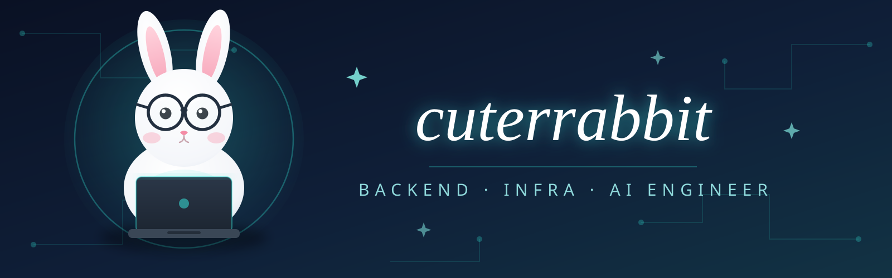

 

## 👋 Hi, There! 🐰
⚽ 축구 ➔ 🎮 FM 죽돌이 ➔ 📊 경기 분석/최적화를 위한 코딩 시작  
➔ **데이터가 흐르는 아키텍처를 설계**하는 게 더 재밌어서 IT로 정착했습니다.  
현재는 백엔드, 클라우드, 그리고 인프라를 공부하고 있습니다.
 

- 🌱 Spring Boot · FastAPI 백엔드를 최적화된 이미지로 컨테이너 기반으로 배포하는 걸 좋아해요 → 도커파일 최적화하는 게 취미
- 🤖 MCP 기반 LLM Agent 및 AIOps, RAG 파이프라인 → AI Native 서비스 만들기가 요즘 목표
- 📊 "측정할 수 없으면 관리할 수 없다"를 믿는 사람 (FM에서 배운 철학) → 대시보드를 보는 걸 좋아합니다 
- 🎮 인프라계의 펩 과르디올라를 꿈꾸는 사람 → 전술(아키텍처)을 짜고 선수(컨테이너)들이 유기적으로 맞물리는 과정을 즐깁니다
- 📈 CA(현재능력)보다 PA(잠재능력)에 베팅하는 유형 → 아직 성장 중이고, 다음 시즌 폼은 더 좋을 겁니다
- 🐧 **"네가 있기에 내가 있다"** 우분투의 철학 → 팀이 서로 유기적으로 연결되어 시너지를 낼 때 가장 재미있고 행복합니다

 

## 🎓 Education & Experience

| 기간 | 내용 |
|:---:|---|
| 2025.12 – 2026.06 | 우리FIS아카데미 클라우드 엔지니어링 과정 (6기) |
| 2023.01 – 2023.02 | 한림대학교 나노팹 전공정 실습 과정 |
| 2022.09 – 2022.12 | 한국재료연구원 공동실험 (자성재료 공정 최적화 프로젝트) |
| 2017.03 – 2023.08 | 부산대학교 재료공학과 (화학 부전공) |

 

## 🏆 Awards

| 날짜 | 수상 | 수여기관 | 내용 |
|:---:|---|---|---|
| 2026.06 | 프로젝트 최우수상 | 우리FIS아카데미 | 농업 BNPL 플랫폼 |
| 2026.06 | 융합해커톤 우수상 | 우리FIS아카데미 | 시니어 소비패턴 기반 라이프스타일 추천 플랫폼 |
| 2025.05 | 연구 과제 부문 최우수상 | 국민연금연구원 | 연금 가입 연령 조정에 따른 모델링 및 시뮬레이션 |

 

## 📜 Certifications

| 자격증 | 발급기관 | 취득일 |
|---|---|:---:|
| 리눅스마스터 2급 | 한국정보통신진흥협회 | 2026.04.03 |
| 정보처리기사 | 한국산업인력공단 | 2025.12.24 |
| SQLD (SQL 개발자) | 한국데이터산업진흥원 | 2025.12.12 |
| 위험물산업기사 | 한국산업인력공단 | 2025.09.12 |
| ADsP (데이터분석 준전문가) | 한국데이터산업진흥원 | 2025.09.05 |

 

## 📂 Projects

| Project | Description | Tech | GitHub |
|---|---|---|---|
| 🏆 **콩콩팥팥** | 농업 데이터 기반 BNPL 서비스. MCP 기반 AIOps 백엔드, GRU 트래픽 예측 오토스케일링, MSA 단위 테스트·LocalStack SQS 테스트 환경 담당 | FastAPI · FastMCP · Spring Boot · PyTorch · Kubernetes | [Repo](https://github.com/FISA-Agri-Pay) |
| **프라이빗 클라우드 구축** | 중첩 가상화 기반 vSphere 클러스터 — HA, 망분리 방화벽, iSCSI 공유 스토리지, vMotion/FT | VMware vSphere · pfSense · TrueNAS | [Repo](https://github.com/fisa-network-virtualization/VMware) |
| **Docker 이미지 경량화** | Spring Boot 이미지 753MB → 122MB(-84%) 단계별 최적화, CI/CD 빌드시간·클라우드 비용 임팩트 정량 분석 | Docker · Spring Boot · jlink | [Repo](https://github.com/cuterrabbit/About_Docker) |
| **카드 소비 데이터 분석** | 카드 이용 데이터 전처리 후 Elasticsearch 적재, Kibana 대시보드로 소비 패턴 인사이트 도출 | Elasticsearch · Kibana · SQL | [Repo](https://github.com/cuterrabbit/elasticProject) |
| **RAG 학습 어시스턴트** | 분산된 학습 자료를 벡터화해 근거 기반 답변 제공, n8n으로 크롤링–적재–리포트 자동화 | n8n · Pinecone · ELK · Docker | [Repo](https://github.com/cuterrabbit/woorifisa-n8n-project) |

 

## 📚 Study

| 저장소 | 내용 |
|---|---|
| [`predictive-vs-learned-autoscaling`](https://github.com/cuterrabbit/predictive-vs-learned-autoscaling) | 콩콩팥팥의 시계열 예측값을 기반으로 파드 결정 정책을 threshold, MPC, RL 비교 및 분석 |
| [`linux-container-from-scratch`](https://github.com/cuterrabbit/linux-container-from-scratch) | Docker의 핵심 메커니즘인 namespace/cgroups v2/seccomp/OverlayFS 직접 구현 |
| [`springboot-_mysql_on_kubernetes`](https://github.com/cuterrabbit/springboot-_mysql_on_kubernetes) | 3개의 VM 기반으로 k8s 클러스터 구축 — Ingress, StatefulSet, 부하테스트 |
| [`docker-hub-Lab`](https://github.com/cuterrabbit/docker-hub-Lab) | Dockerfile 5단계 최적화 비교 — 멀티스테이지, distroless, BuildKit 캐시 |
| [`docker-compose-lab`](https://github.com/cuterrabbit/docker-compose-lab) | Docker HealthCheck 기반 컨테이너 실행 순서 제어 실험 |
| [`mistakes-in-java-streams`](https://github.com/cuterrabbit/mistakes-in-java-streams) | Java Stream 성능 비교 스터디 진행 — For-loop/Sequential/Parallel Stream 실행 시간 측정 및 분석 |

 

## 🛠 Tech Stack

| Category | Stack |
|---|---|
| 💻 Language |    |
| 🚀 Framework |   |
| 📦 Container |   |
| 🖥️ Cloud & Infra |     |
| 🔄 CI/CD & Automation |     |
| 🤖 AI & LLM | -111827?style=for-the-badge)   |
| 📊 Data & Monitoring |        |
 

## 📫 Contact

 

